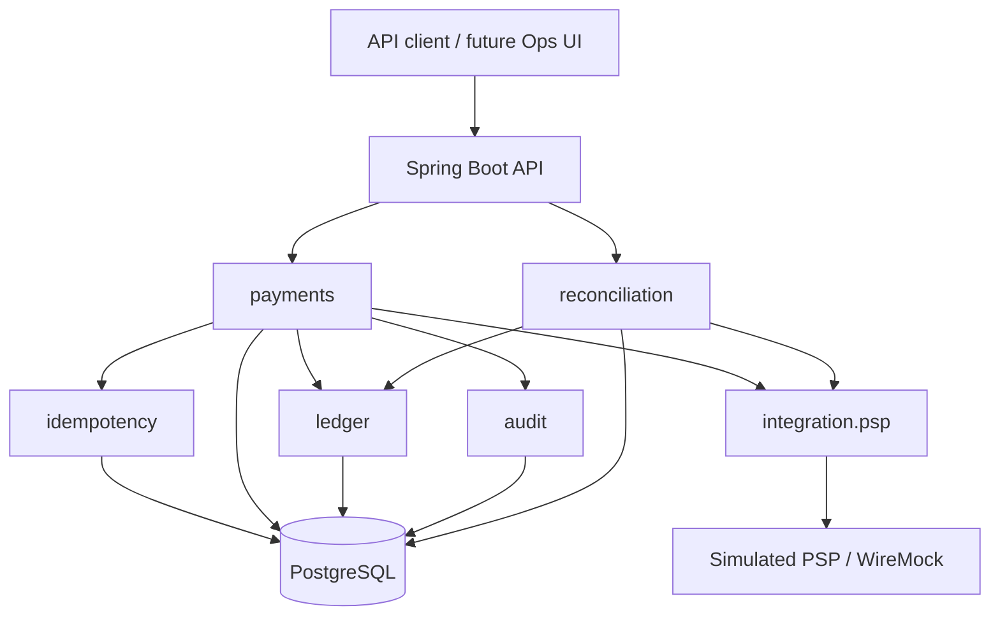

# Sentinel Ledger

> Payment orchestration with an immutable double-entry ledger, persistent idempotency, reconciliation, and production-grade observability.

[](#project-status)
[](#technology-strategy)
[](#technology-strategy)
[](#architecture)

## Overview

Sentinel Ledger is a portfolio project about the engineering challenges behind reliable payment processing. It models payment intents, authorization, capture, refund, an append-only double-entry ledger, persistent idempotency, and operational reconciliation against a simulated payment service provider (PSP).

The system starts as a **modular monolith**. Its goal is to demonstrate domain modeling, transaction boundaries, concurrency control, failure recovery, security, testing, and observable business behavior without introducing distributed infrastructure before the domain requires it.

## Why this project exists

A payment API is easy to prototype when every request succeeds exactly once. A reliable system must also remain correct when:

- clients retry after timeouts;
- the same operation arrives concurrently;
- a PSP times out after accepting an operation;
- callbacks are duplicated or delivered out of order;
- capture and refund operations race;
- internal state diverges from provider state;
- a process stops between a database commit and event publication.

Sentinel Ledger treats those situations as primary design inputs, not as afterthoughts.

## Project status

**Current phase: specification and architectural foundation.**

No production implementation is claimed yet. The initial milestone closes the domain rules, architectural decisions, API outline, acceptance criteria, and delivery plan before the Spring Boot codebase is generated.

## MVP scope

The first usable version is constrained to:

- one merchant;
- one currency: BRL;
- one simulated PSP;
- payment intent creation and authorization;
- full and partial capture;
- full and partial refund;
- append-only double-entry ledger;
- persistent idempotency;
- audit trail;
- simple reconciliation;
- payment timeline.

### Explicit non-goals

The MVP will not include real payment credentials, multiple PSPs, multiple currencies, chargebacks, split payments, subscriptions, antifraud, schema-per-tenant multi-tenancy, event sourcing, microservices, Redis, Kafka, Kubernetes, GraalVM Native Image, or authoritative balance caching.

These capabilities may be evaluated later only through measured requirements and explicit ADRs.

## Core domain invariants

1. A capture cannot exceed the authorized amount.
2. The sum of successful captures cannot exceed the authorized amount.
3. The sum of successful refunds cannot exceed the net captured amount.
4. Every posted ledger transaction must be balanced.
5. Ledger entries are append-only and are never updated or deleted.
6. Corrections are represented by compensating transactions.
7. The same idempotency key and request payload cannot produce two effects.
8. Reusing an idempotency key with a different payload is rejected.
9. Only explicitly allowed payment state transitions may occur.
10. Duplicate external events cannot reapply a business effect.

## Architecture



### Planned modules

| Module | Responsibility |
| --- | --- |
| `payments` | Payment intent lifecycle, authorization, capture, and refund |
| `ledger` | Accounts, balanced transactions, immutable entries, and rebuildable projections |
| `reconciliation` | Detecting and resolving divergence between internal and simulated PSP state |
| `idempotency` | Persistent request identity, payload fingerprinting, and response replay |
| `integration.psp` | Provider contract, timeouts, status lookup, and callback translation |
| `merchant` | Merchant identity and configuration for the single-merchant MVP |
| `audit` | Append-only evidence of sensitive business and operator actions |
| `observability` | Correlation, business metrics, traces, and operational health |

Spring Modulith will verify dependencies, reject cycles and access to internal packages, and support module-focused tests and documentation.

## Critical transaction boundary

External PSP calls must not run while a PostgreSQL transaction remains open.

```text
Persist AUTHORIZATION_PENDING
        |
        v
Commit the local transaction
        |
        v
Call the simulated PSP
        |
        v
Persist AUTHORIZED, DECLINED, or UNKNOWN
        |
        v
Recover UNKNOWN through status lookup or callback
```

Capture and refund effects will update payment state, post balanced ledger entries, and record audit evidence in one local transaction.

## Initial API outline

| Method | Endpoint | Purpose |
| --- | --- | --- |
| `POST` | `/api/v1/payment-intents` | Create a payment intent |
| `GET` | `/api/v1/payment-intents/{id}` | Read current payment state |
| `POST` | `/api/v1/payment-intents/{id}/authorize` | Request authorization |
| `POST` | `/api/v1/payment-intents/{id}/captures` | Capture an authorized amount |
| `POST` | `/api/v1/payment-intents/{id}/refunds` | Refund a captured amount |
| `GET` | `/api/v1/payment-intents/{id}/timeline` | Read the state and audit timeline |
| `GET` | `/api/v1/ledger/accounts/{id}/entries` | Browse ledger entries with cursor pagination |
| `GET` | `/api/v1/reconciliation/cases` | List detected mismatches |
| `POST` | `/api/v1/reconciliation/cases/{id}/resolve` | Record an operator resolution |

All mutating operations will require an `Idempotency-Key` header.

## Technology strategy

- Java 25 LTS;
- Spring Boot 4.1;
- Spring Modulith 2.1;
- Spring Security 7.1;
- PostgreSQL 18, with 17 accepted when hosting compatibility requires it;
- Flyway and Maven;
- Testcontainers, JUnit 5, AssertJ, RestAssured, WireMock, and ArchUnit;
- OpenAPI;
- Micrometer and OpenTelemetry;
- k6 for focused concurrency scenarios.

Records will be preferred for commands, responses, events, and value objects. Sealed interfaces and pattern matching may model explicit outcomes. Virtual threads will be adopted only for suitable blocking I/O and validated by measurement.

## Testing strategy

Quality is defined by proven behavior, not by a target test count or coverage percentage.

The minimum portfolio includes state and monetary invariant tests, balanced-ledger property tests, PostgreSQL integration tests, simulated PSP failure scenarios, concurrent capture and refund tests, idempotency collision and replay tests, module boundary tests, API contract tests, and a reproducible k6 scenario.

The required concurrency proof will run at least twenty simultaneous capture requests against one authorized payment and prove that the final captured total never exceeds the authorization.

## Observability and security

Telemetry will correlate API, database, simulated PSP, and future broker operations with business identifiers. No latency or throughput promise will be published without a reproducible benchmark environment.

The project will never store PAN, CVV, real card tokens, or production payment credentials. Merchant identity must come from authenticated context, never from an untrusted header alone. Sensitive operator actions will be authorized and audited.

## Delivery roadmap

| Phase | Outcome |
| --- | --- |
| 0 — Specification | Domain model, invariants, ADRs, API outline, acceptance criteria |
| 1 — Transactional core | Payment intent, authorization, persistent idempotency, simulated PSP |
| 2 — Ledger and concurrency | Capture, refund, double-entry ledger, audit, concurrency proof |
| 3 — Reliability | Transactional outbox, RabbitMQ, inbox, retries, DLQ, webhooks, reconciliation |
| 4 — Demonstration | Operations UI, dashboards, benchmark report, public deployment |

See [docs/ROADMAP.md](docs/ROADMAP.md) for exit criteria and [docs/adr](docs/adr) for the decision register.

## Documentation

- [Project brief](docs/PROJECT_BRIEF.md)
- [Architecture](docs/ARCHITECTURE.md)
- [Domain model](docs/DOMAIN_MODEL.md)
- [Roadmap](docs/ROADMAP.md)
- [Architectural decisions](docs/adr/README.md)
- [Contributing](CONTRIBUTING.md)
- [Security policy](SECURITY.md)

## License

No open-source license has been selected yet. Until a license is explicitly added, all rights remain reserved by the copyright holder.

## Author

**Vinicius de Oliveira Santos** — [@vinicius-ssantos](https://github.com/vinicius-ssantos)

---

Sentinel Ledger is an educational portfolio system. It does not process real payments and must not be used as financial infrastructure.
