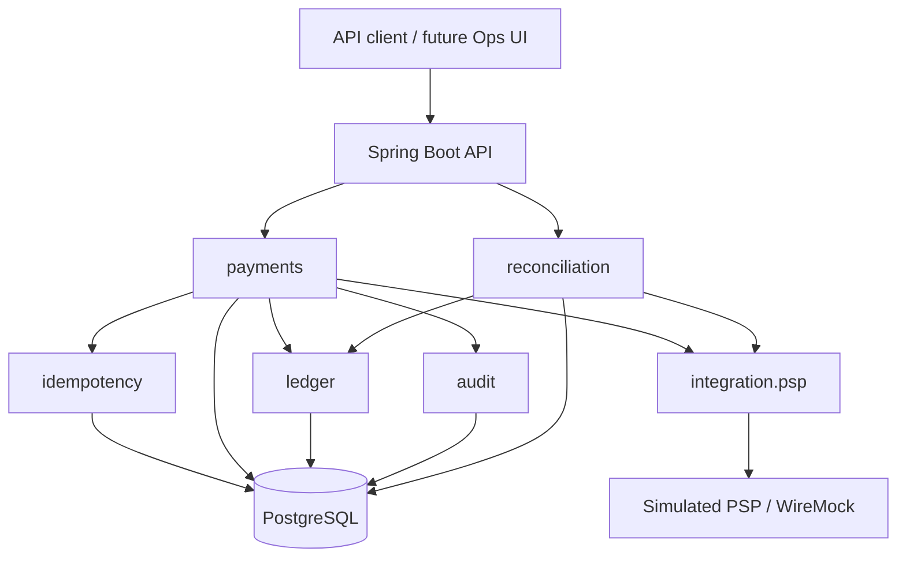

# Sentinel Ledger

> Payment orchestration with an immutable double-entry ledger, persistent idempotency, reconciliation, and production-grade observability.

[](#project-status)
[](#technology-strategy)
[](#technology-strategy)
[](#architecture)

## Overview

Sentinel Ledger is a portfolio project about the engineering challenges behind reliable payment processing. It models payment intents, authorization, capture, refund, an append-only double-entry ledger, persistent idempotency, and operational reconciliation against a simulated payment service provider (PSP).

The system starts as a **modular monolith**. Its goal is to demonstrate domain modeling, transaction boundaries, concurrency control, failure recovery, security, testing, and observable business behavior without introducing distributed infrastructure before the domain requires it.

> **Engineering claim:** even under retry, concurrency, timeout, restart, duplicate delivery, and provider divergence, the system preserves financial truth and can explain exactly what happened.

## Why this project exists

A payment API is easy to prototype when every request succeeds exactly once. A reliable system must also remain correct when:

- clients retry after timeouts;
- the same operation arrives concurrently;
- a PSP times out after accepting an operation;
- callbacks are duplicated or delivered out of order;
- capture and refund operations race;
- internal state diverges from provider state;
- a process stops between a database commit and event publication.

Sentinel Ledger treats those situations as primary design inputs, not as afterthoughts.

## Project status

**Current phase: Phase 1 executable modular foundation.**

The repository contains an executable Java 25 and Spring Boot 4.1 foundation with Spring Modulith 2.1. Functional module boundaries, allowed dependency directions, cycle detection, internal-package protection, isolated module bootstrap, generated module documentation, health checks, and reproducible Maven verification are enforced in the build. Payment intent creation, lookup, and authorization against a deterministic simulated PSP are backed by PostgreSQL behind an authenticated merchant boundary and persistent idempotency, with no database transaction held across the provider call; capture, refund, ledger, and production-readiness claims remain intentionally unimplemented.

## Local development

### Prerequisites

- JDK 25, selected by `.java-version` when supported by your version manager;
- Git;
- Docker with Compose support.

Integration tests start a real PostgreSQL container through Testcontainers. Running the application locally uses the PostgreSQL service declared in `compose.yaml`. The default `sentinel` credentials are development-only and can be overridden with `SENTINEL_DB_*` environment variables.

On Linux or macOS, verify and run the application with:

```bash
./mvnw verify
docker compose up -d postgres
./mvnw spring-boot:run
```

On Windows, use:

```powershell
mvnw.cmd verify
docker compose up -d postgres
mvnw.cmd spring-boot:run
```

`verify` requires a running Docker engine but does not require the Compose database because Testcontainers creates an isolated PostgreSQL instance. To reset the local development database, run `docker compose down -v` and start it again. Check container health with `docker compose ps` and inspect startup failures with `docker compose logs postgres`.

With the application running, verify its local health endpoint:

```bash
curl http://localhost:8080/actuator/health
```

PowerShell users can run `Invoke-RestMethod http://localhost:8080/actuator/health`. The expected status is `UP`. The first business endpoints, payment intent creation and lookup, are documented below and require HTTP Basic merchant authentication; interactive OpenAPI documentation is served at `/swagger-ui.html` once the application is running.

`./mvnw verify` also validates the Spring Modulith structure, starts PostgreSQL integration tests, applies and validates Flyway migrations from an empty database, and generates diagrams plus module canvases under `target/spring-modulith-docs`.

Flyway migrations live under `src/main/resources/db/migration` and follow `V<version>__<snake_case_description>.sql`. After the baseline, migration descriptions must include the owning module, for example `V2__payments_create_payment_intents.sql`. Existing versioned migrations are immutable after merge; corrections use a new migration.

## MVP scope

The first usable version is constrained to:

- one merchant;
- one currency: BRL;
- one simulated PSP;
- payment intent creation and authorization;
- explicit recovery of uncertain provider outcomes;
- full and partial capture;
- full and partial refund;
- append-only double-entry ledger;
- persistent idempotency;
- audit trail;
- mismatch detection and auditable reconciliation;
- payment timeline.

### Explicit non-goals

The MVP will not include real payment credentials, multiple PSPs, multiple currencies, chargebacks, split payments, subscriptions, antifraud, schema-per-tenant multi-tenancy, event sourcing, microservices, Redis, Kafka, Kubernetes, GraalVM Native Image, or authoritative balance caching.

These capabilities may be evaluated later only through measured requirements and explicit ADRs.

## Core domain invariants

1. The total successful capture cannot exceed the authorized amount.
2. The total successful refund cannot exceed captured value not previously refunded.
3. The MVP accepts no new capture after the first successful refund.
4. Only explicitly allowed payment state transitions may occur.
5. Every posted ledger transaction has equal debit and credit totals.
6. Ledger entries are append-only and are never updated or deleted.
7. Corrections are represented by compensating transactions.
8. Balance projections can be rebuilt from authoritative ledger entries.
9. The same idempotency key and request payload cannot produce two effects.
10. Reusing an idempotency key with a different payload is rejected.
11. Provider uncertainty is represented explicitly and never guessed as success or failure.
12. Duplicate or out-of-order provider evidence cannot reapply an effect.
13. Repeated reconciliation cannot create duplicate open cases for the same mismatch.
14. Reconciliation resolution preserves original evidence, actor, and reason.
15. Every sensitive business or operator command leaves redacted audit evidence.

Each rule has a stable identifier, enforcement point, and proof requirement in [docs/INVARIANTS.md](docs/INVARIANTS.md).

## Architecture



### Planned modules

| Module | Responsibility |
| --- | --- |
| `payments` | Payment intent lifecycle, authorization, capture, and refund |
| `ledger` | Accounts, balanced transactions, immutable entries, and rebuildable projections |
| `reconciliation` | Detecting and resolving divergence between internal and simulated PSP state |
| `idempotency` | Persistent request identity, payload fingerprinting, and response replay |
| `integration.psp` | Provider contract, timeouts, status lookup, and callback translation |
| `merchant` | Merchant identity and configuration for the single-merchant MVP |
| `audit` | Append-only evidence of sensitive business and operator actions |
| `observability` | Correlation, business metrics, traces, and operational health |

Spring Modulith will verify dependencies, reject cycles and access to internal packages, and support module-focused tests and documentation.

## Critical transaction boundary

External PSP calls must not run while a PostgreSQL transaction remains open, and a transport timeout must not be translated directly into a business failure.

```text
Persist AUTHORIZATION_PENDING and commit
        |
        v
Call the simulated PSP outside the transaction
        |
        v
Persist AUTHORIZED, DECLINED, or AUTHORIZATION_UNKNOWN
        |
        v
Recover uncertainty through status lookup, callback, or reconciliation
```

Capture and refund effects will update payment state, post balanced ledger entries, and record audit evidence in one local transaction.

The complete deterministic failure taxonomy is documented in [docs/FAILURE_MODEL.md](docs/FAILURE_MODEL.md).

## Initial API outline

| Method | Endpoint | Purpose | Status |
| --- | --- | --- | --- |
| `POST` | `/api/v1/payment-intents` | Create a payment intent | Implemented |
| `GET` | `/api/v1/payment-intents/{id}` | Read current payment state | Implemented |
| `POST` | `/api/v1/payment-intents/{id}/authorize` | Request authorization | Implemented |
| `POST` | `/api/v1/payment-intents/{id}/cancel` | Cancel before authorization begins | Planned |
| `POST` | `/api/v1/payment-intents/{id}/captures` | Capture an authorized amount | Planned |
| `POST` | `/api/v1/payment-intents/{id}/refunds` | Refund a captured amount | Planned |
| `GET` | `/api/v1/payment-intents/{id}/timeline` | Read the state and audit timeline | Planned |
| `GET` | `/api/v1/ledger/accounts/{id}/entries` | Browse ledger entries with cursor pagination | Planned |
| `GET` | `/api/v1/reconciliation/cases` | List detected mismatches | Planned |
| `POST` | `/api/v1/reconciliation/cases/{id}/resolve` | Record an operator resolution | Planned |

Mutating operations require an `Idempotency-Key` header. `POST /api/v1/payment-intents` and `POST /api/v1/payment-intents/{id}/authorize` enforce it today; the remaining planned mutations will enforce it as they are implemented.

## Portfolio acceptance bar

The project is considered portfolio-ready only when a clean checkout can reproduce this evidence:

| Demonstration | Required result |
| --- | --- |
| Same request submitted three times | One effect and a replayable stored outcome |
| Same key reused with a modified request | Stable conflict and no second effect |
| At least twenty concurrent captures | Captured total never exceeds authorization |
| PSP processes authorization but loses the response | Explicit uncertain state followed by evidence-based recovery |
| Partial refund | New balanced compensating transaction; prior entries unchanged |
| Provider/internal mismatch followed by restart | One durable case with preserved evidence and audited resolution |

See [docs/DEMO_RUNBOOK.md](docs/DEMO_RUNBOOK.md) for the golden demo contract.

## Technology strategy

- Java 25 LTS;
- Spring Boot 4.1;
- Spring Modulith 2.1;
- Spring Security 7.1;
- PostgreSQL 18, with 17 accepted when hosting compatibility requires it;
- Flyway and Maven;
- Testcontainers, JUnit 5, AssertJ, RestAssured, WireMock, and ArchUnit;
- OpenAPI;
- Micrometer and OpenTelemetry;
- k6 for focused concurrency scenarios.

Records will be preferred for commands, responses, events, and value objects. Sealed interfaces and pattern matching may model explicit outcomes. Virtual threads will be adopted only for suitable blocking I/O and validated by measurement.

## Testing strategy

Quality is defined by proven behavior, not by a target test count or coverage percentage. Every implemented invariant must be traced to domain, PostgreSQL, concurrency, recovery, or demonstration evidence as appropriate.

The minimum portfolio includes state and monetary invariant tests, balanced-ledger property-oriented tests, PostgreSQL integration tests, simulated PSP failure scenarios, concurrent capture and refund tests, idempotency collision/replay/restart tests, reconciliation deduplication tests, module boundary tests, API contract tests, and a reproducible k6 scenario.

The required concurrency proof will run at least twenty simultaneous capture requests against one authorized payment and prove that the final captured total never exceeds the authorization. Performance results are invalid if the final invariant checks are omitted.

## Observability and security

Telemetry will correlate API, database, simulated PSP, and future broker operations with business identifiers. No latency or throughput promise will be published without a reproducible benchmark environment.

The project will never store PAN, CVV, real card tokens, or production payment credentials. Merchant identity must come from authenticated context, never from an untrusted header alone. Sensitive operator actions will be separately authorized, confirmed, and audited. The lightweight threat model is maintained in [docs/THREAT_MODEL.md](docs/THREAT_MODEL.md).

## Delivery roadmap

| Phase | Outcome |
| --- | --- |
| 0 — Specification | Domain model, invariants, ADRs, API outline, acceptance criteria |
| 1 — Transactional core | Payment intent, authorization, persistent idempotency, simulated PSP |
| 2 — Financial correctness and recovery | Capture, refund, double-entry ledger, audit, concurrency proof, reconciliation |
| 3 — Async reliability and observability | Transactional outbox, RabbitMQ, inbox, retries, DLQ, signed webhooks, telemetry |
| 4 — Portfolio demonstration | Investigation-focused Ops UI, golden demo, benchmark report, public deployment |

See [docs/ROADMAP.md](docs/ROADMAP.md) for exit criteria and [docs/adr](docs/adr) for the decision register.

## Coding-agent instructions

Repository-wide instructions for coding agents live in [AGENTS.md](AGENTS.md). [CLAUDE.md](CLAUDE.md) imports that shared source for Claude Code and contains only Claude-specific guidance. Personal Claude Code preferences belong in the ignored `CLAUDE.local.md` file. Run `./mvnw verify` for the canonical application build and `python3 scripts/validate_docs.py` for the documentation and instruction-file contract; both checks run in GitHub Actions.

## Documentation

- [Project brief](docs/PROJECT_BRIEF.md)
- [Architecture](docs/ARCHITECTURE.md)
- [Domain model](docs/DOMAIN_MODEL.md)
- [Payment state machine](docs/PAYMENT_STATE_MACHINE.md)
- [Ledger policy and postings](docs/LEDGER_POSTINGS.md)
- [Persistent idempotency and errors](docs/IDEMPOTENCY_AND_ERRORS.md)
- [Engineering invariants](docs/INVARIANTS.md)
- [Failure model](docs/FAILURE_MODEL.md)
- [Threat model](docs/THREAT_MODEL.md)
- [Golden demo runbook](docs/DEMO_RUNBOOK.md)
- [Roadmap](docs/ROADMAP.md)
- [Architectural decisions](docs/adr/README.md)
- [Repository instructions for coding agents](AGENTS.md)
- [Claude Code adapter](CLAUDE.md)
- [Contributing](CONTRIBUTING.md)
- [Security policy](SECURITY.md)

## License

No open-source license has been selected yet. Until a license is explicitly added, all rights remain reserved by the copyright holder.

## Author

**Vinicius de Oliveira Santos** — [@vinicius-ssantos](https://github.com/vinicius-ssantos)

---

Sentinel Ledger is an educational portfolio system. It does not process real payments and must not be used as financial infrastructure.
